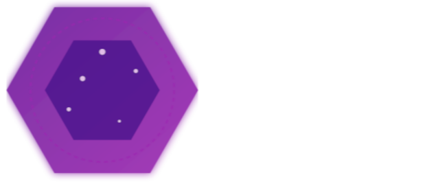

# Xylon 🚀

Xylon is a super-optimized 3D game engine designed to deliver high performance and flexibility for high-quality games. The engine is built with the goal of being simple, fast, and efficient, allowing developers to create immersive experiences with minimal overhead.

## Features ✨

- **3D Rendering**: Full support for 3D graphics using OpenGL. 🌐
- **Raycasting**: Raycasting implementation for simulating light and shadows. 🌞🌑
- **Performance**: Focused on optimization and efficient resource usage. ⚡
- **Extensibility**: The engine is designed to be easily extensible, allowing you to add new features as needed. 🔧

## Requirements ⚙️

> [!WARNING]
Windows platforms are not supported in this Alpha release. 🚫

- **Operating System**: Linux (Arch Linux recommended) 🐧
- **Language**: C++11 or later
- **Libraries**: OpenGL, GLFW, GLEW (or others depending on your setup) 📚
- **Others**: Ensure that you have the appropriate graphics driver installed. 🎮

> [!TIP]
> You can help us by using the --debug flag on!

## How to Use 🛠️

1. Clone the repository:
   ```bash
   git clone https://github.com/Xylon/Xylon.git

2. Build the engine:
   ```bash
   ./build.sh

3. Run:

   ```bash
   ./bin/XylonEngine

# Contributing 🤝
If you want to contribute to Xylon, feel free to open a pull request or an issue. Before contributing, make sure your code is well-documented and follows the project's conventions. 📄

# License 📜
This project is licensed under the Xylon License - see the LICENSE file for details.

# Contact 📬
- Company: Inferno Interactive
- Email: support@infernointeractive.win
